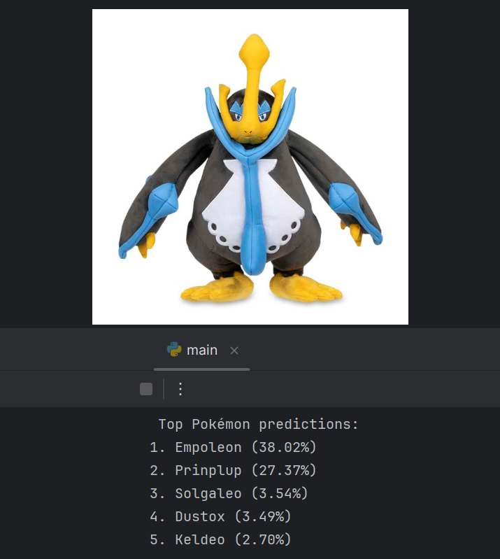

# ai-dex
## TODO
1. bring in pre-trained model DONE
2. fine-tune for our dataset of unique characters DONE
3. add background noise to augment sprite-based dataset
4. add smartphone functionality

## RESULT

